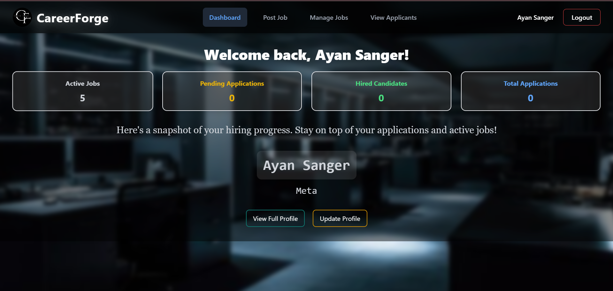

<div align="center">

# 🚀 CareerForge

### *Where Talent Meets Opportunity*

[](https://career-forge-portal.netlify.app)
[](https://careerforge-a3ui.onrender.com)
[](LICENSE)


</div>

---

## 🎯 Vision

**CareerForge** is not just another job portal—it's a comprehensive ecosystem that revolutionizes the recruitment experience. Built with cutting-edge technologies, it seamlessly bridges the gap between ambitious job seekers and forward-thinking employers.

<div align="center">

### ⚡ Quick Stats

| 🎨 **Modern UI** | 🔐 **Secure Auth** | 📧 **Auto Notifications** | 🐳 **Containerized** |
|:---:|:---:|:---:|:---:|
| React + Tailwind | Spring Security | Email Integration | Docker Ready |

</div>

---

## ✨ What Makes CareerForge Special?

<table>
<tr>
<td width="50%">

### 👔 For Employers
- **Smart Job Management** - Create, edit, and manage postings effortlessly
- **Applicant Tracking** - Streamlined candidate management
- **Real-time Notifications** - Stay updated on applications
- **Intuitive Dashboard** - All tools at your fingertips

</td>
<td width="50%">

### 🎯 For Job Seekers
- **Personalized Experience** - Tailored job recommendations
- **One-Click Apply** - Simplified application process
- **Application Tracking** - Monitor your journey
- **Profile Management** - Showcase your skills

</td>
</tr>
</table>

---

## 🛠️ Tech Arsenal

<div align="center">

### Frontend Powerhouse


### Backend Fortress


### Infrastructure & DevOps


</div>

---

## 🏗️ System Architecture


---

## 🚀 Quick Start

### Prerequisites
```bash
☕ Java 21+
📦 Node.js 18+
🐳 Docker (optional)
🗃️ MySQL
```

### 🔧 Installation

1️⃣ **Clone the Repository**
```bash
git clone https://github.com/vamshi-amudala/careerforge.git
cd careerforge
```

2️⃣ **Backend Setup**
```bash
cd back-end
mvn clean install
mvn spring-boot:run
```
> Backend will run on `http://localhost:8080` 🎯

3️⃣ **Frontend Setup**
```bash
cd front-end
npm install
npm run dev
```
> Frontend will run on `http://localhost:5173` ✨

### 🐳 Docker Deployment
```bash
docker build -t careerforge-backend ./back-end
docker run -p 8080:8080 careerforge-backend
```

---

## 📸 Glimpse into CareerForge

<div align="center">

### 🎨 Landing Experience


<table>
<tr>
<td width="50%">
<h3 align="center">🎯 Job Seeker Portal</h3>

</td>
<td width="50%">
<h3 align="center">👔 Employer Hub</h3>

</td>
</tr>
</table>

</div>

---

## 🌟 Key Features Deep Dive

<details>
<summary>🔐 <b>Authentication & Security</b></summary>

- Role-based access control (RBAC)
- JWT token authentication
- Password encryption with BCrypt
- Session management
- CSRF protection
</details>

<details>
<summary>📋 <b>Job Management System</b></summary>

- CRUD operations for job postings
- Advanced search and filtering
- Category-based organization
- Job expiration tracking
- Application status management
</details>

<details>
<summary>📧 <b>Notification System</b></summary>

- Email verification on registration
- Application confirmation emails
- Status update notifications
- Scheduled email reminders
- Template-based email system
</details>

<details>
<summary>🎨 <b>UI/UX Excellence</b></summary>

- Responsive design for all devices
- Smooth animations with Framer Motion
- Dark/Light mode support
- Accessible components
- Loading states and error handling
</details>

---

## 🤝 Contributing

We welcome contributions from the community! Here's how you can help:

```bash
# 1. Fork the repository
# 2. Create your feature branch
git checkout -b feature/AmazingFeature

# 3. Commit your changes
git commit -m '✨ Add some AmazingFeature'

# 4. Push to the branch
git push origin feature/AmazingFeature

# 5. Open a Pull Request
```

<div align="center">

### 💡 Contribution Ideas
🐛 **Bug Fixes** | ✨ **New Features** | 📝 **Documentation** | 🎨 **UI Improvements**

</div>

---

## 📊 Project Stats

<div align="center">


</div>

---

## 📄 License

This project is licensed under the MIT License - see the [LICENSE](LICENSE) file for details.

```
MIT License - Feel free to use this project for learning and commercial purposes!
```

---

## 👨‍💻 Author

<div align="center">

### Vamshi Amudala

[](https://github.com/vamshi-amudala)
[](https://linkedin.com/in/vamshi-amudala)

**Full-Stack Developer | Java Enthusiast | Open Source Contributor**

</div>

---

## 🙏 Acknowledgments

<div align="center">

Special thanks to:
- 💚 **Spring Boot Community** for the amazing framework
- ⚛️ **React Team** for the powerful UI library
- 🎨 **Tailwind Labs** for the utility-first CSS framework
- 🌟 **All Contributors** who helped make this project better

</div>

---

<div align="center">

### ⭐ Star this repo if you found it helpful!

**Made with ❤️ and lots of ☕**


*CareerForge - Forging Careers, Building Futures* 🚀

</div>
